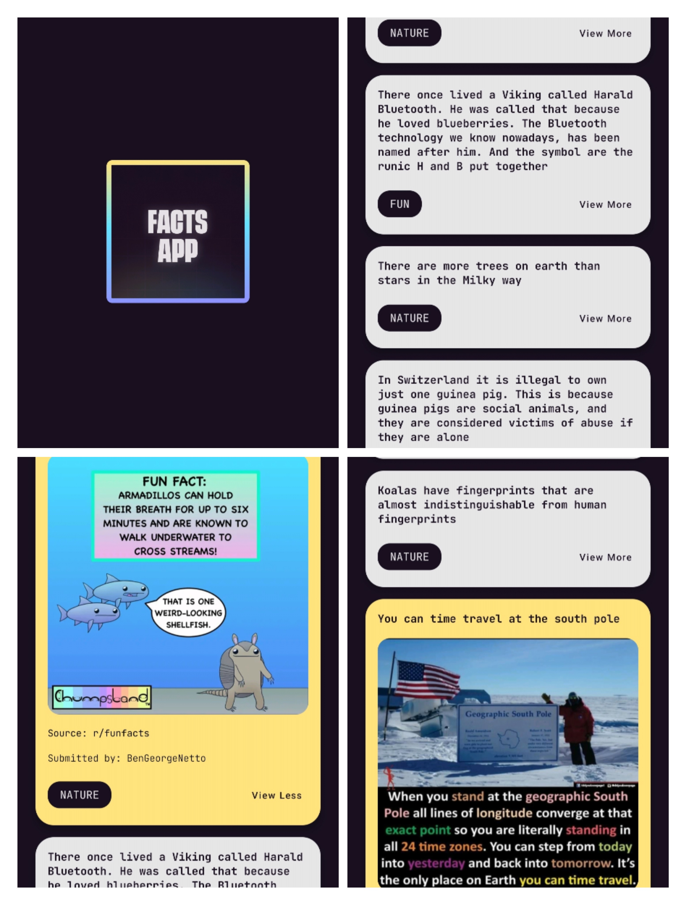

# Facts-App
Android app built using Jetpack Compsoe for displaying facts.

</br>

# Contributing

> Detailed instructions can be found in the [Contributing file](./CONTRIBUTING.md).
- Clone the repository
  ```sh
  git clone https://github.com/dscmbcet/Facts-App
  ```
- Open the [Datasource.kt](./app/src/main/java/com/example/factsapp/data/Datasource.kt) file.
- Add in your fact data in the below format
  ```kt
  Fact(
        info = "This is an example of a fact " + 
            "having multiple lines.",
        source = "r/funfacts",
        imageId = R.drawable.yourFileName,
        type = FactType.FUN,
        submittedBy = "yourName"
    )
  ```
- Open a pull request to this repository.

> Image should be uploaded on the [res/drawable](./app/src/main/java/com/example/factsapp/res/drawable) folder, and the `imageId` would be `R.drawable.yourFileName`.
   
> Available fact types:  
    - FUN,  
    - INTERESTING  
    - SCIENCE  
    - NATURE  
    - TECH  
    - MISC  
     
</br>

# Screenshots


</br>

# Contributors
[](https://github.com/dscmbcet/Facts-App/graphs/contributors)

</br>

[](https://gdscmbcet.com)